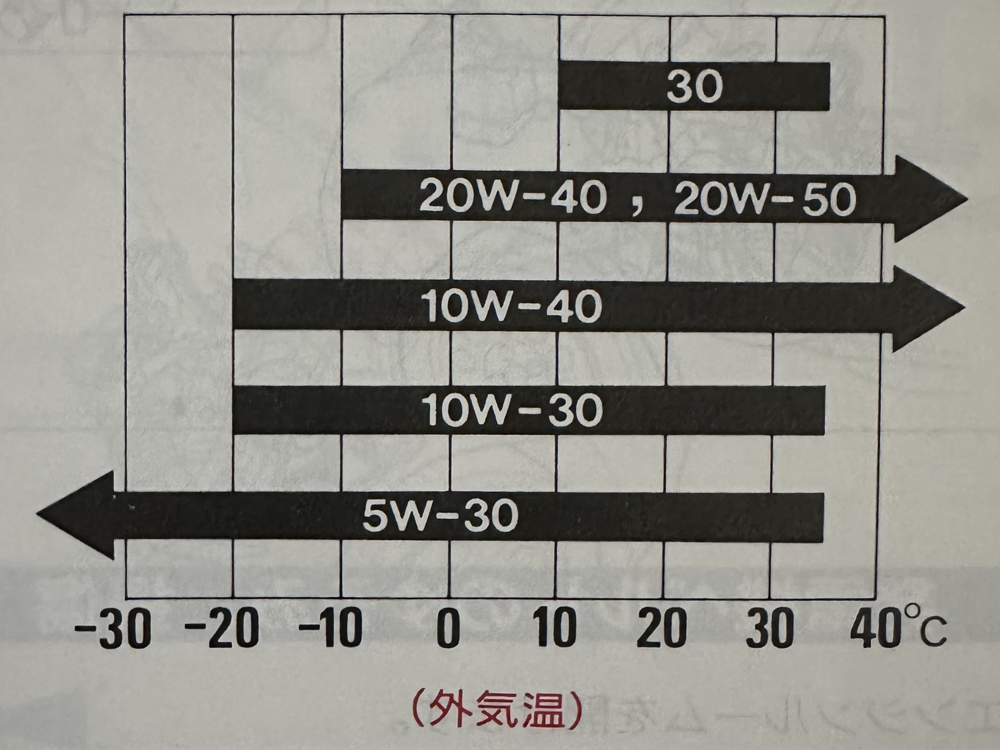

  

    Table of contents
  

  {: .text-delta }
1. TOC
{:toc}

## What type of fluids should I use in my Honda Beat?

### Engine oil
{: .no_toc }

Generally, the Beat takes 3 liters of 10w30 oil when completely empty. Though Honda recommends the following weights depending on outside temperature:

Further, the service manual states that you should only need 2.7 liters of oil when replacing the oil and filter. This reduces to 2.5 liters when changing just the oil.

The part number for the oil filter is #15400-PLM-A02 and should be pretty widely available in the U.S. because it was used on other period Hondas. Honda recommends replacement every 20,000 km (≈12,500 mi).

### Transmission oil
{: .no_toc }

Honda recommends 10w30 oil or Honda MTF. Replacement is recommended every 40,000 km (≈25,000 mi). When replacing, you'll need 1.2 liters. If your transmission is completely dry, you'll need 1.3 liters.

### Coolant
{: .no_toc }

Honda recommends changing the coolant every 2 years with 4.7 liters of 50% distilled water and 50% standard Honda Blue. If your cooling system is completely dry, you'll need 6 liters of the same coolant mixture.

### Brake fluid
{: .no_toc }

DOT 3 or DOT 4

### Clutch fluid
{: .no_toc }

DOT 3 brake fluid

### Gasoline
{: .no_toc }

The Honda Beat runs on "regular" Japanese gas. Regular gas in Japan is >= 89 RON, which is roughly 85 octane in the U.S.

## How often should I change my timing belt?

Honda recommends that the Beat's timing belt is changed every 100,000 km (≈62,000 mi). However, a broken timing belt can lead to catastrophic damage to your hard-to-source 3-cylinder engine.

As a result, most Beat owners recommend changing the timing belt as soon as possible if you don't have records of it being recently changed. When changing the timing belt, you should also change the water pump, idler pulley, and tensioner pulley.

## What type of spark plugs do I need for my Beat?

Honda recommends using NGK BKR6E-11/BKR7E-11 or Denso K20PR-U11/K22PR-U11 plugs torqued to 13-15 lb.ft. The service manual recommends a gap of 1.0-1.1 mm. Most U.S. Beat owners go with 0.030 in +/- 0.005 in.

## How often should I replace my air filter?

Honda recommends replacing the air filter every 40,000 km (≈25,000 mi).

## What types of wheels and tires should I use on my Beat?

### Wheels
{: .no_toc }

The stock wheels are:
* Front: 13×4.5J w/ 35 offset
* Rear: 14×5J w/ 45 offset

### Tires
{: .no_toc }

The stock tires are:
* Front: 155/65R13 73H
* Rear: 165/60R14 74H

Good luck finding these locally!

### Spare tire
{: .no_toc }

* Tire: T115/70 D14
* Wheel: 14×4T

## What are the stock alignment values?

### Camber
{: .no_toc }

* Front: -0°30’±1°
* Rear: -0°30’±1°

### Caster
{: .no_toc }

* Front: 7°20’±1°

### Toe
{: .no_toc }

* Front: 0±3
* Rear: 0±3

## How can I tell if my Beat has an LSD?

There's quite a bit of misinformation on the web about which Beats came with limited slip differentials from the factory. My Version Z did not, but I suspect most of the PP1-110 models do.

In any event, it's incredibly easy to test whether your Beat currently has an LSD:

1. Put your Beat on a lift or chock the front wheels and jack up the back
2. Disengage the parking brake
3. Put the car in first gear
4. Put on some short shorts (not optional)
5. Spin one of the back wheels as if the car is driving forward

If the opposite wheel moves in the opposite direction, you don't have a limited slip differential:

