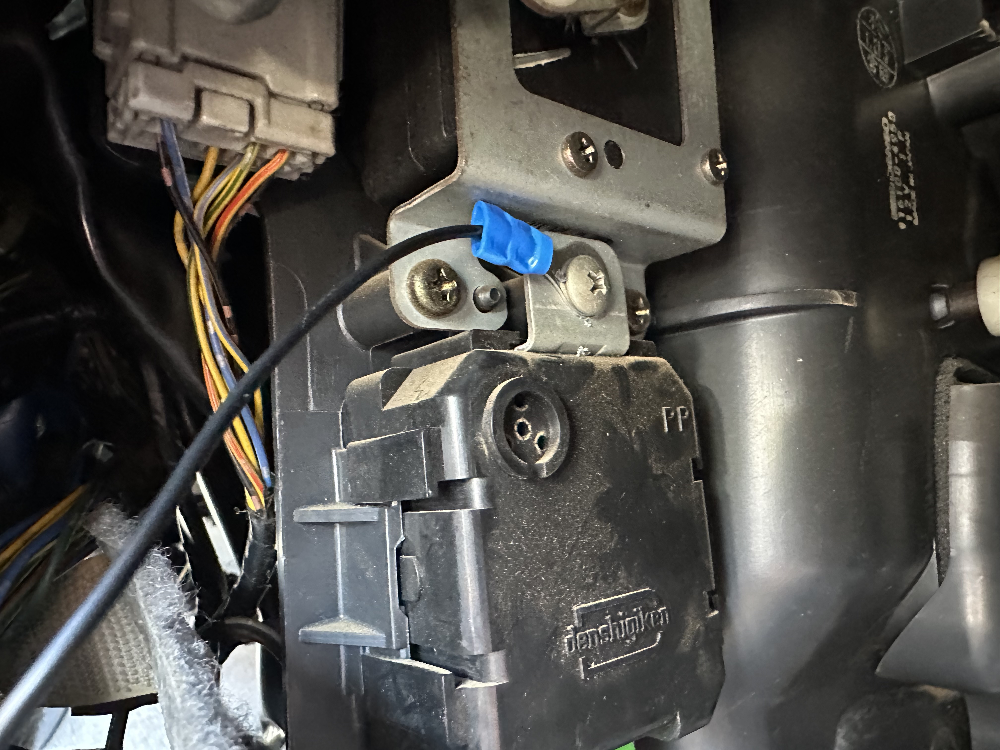
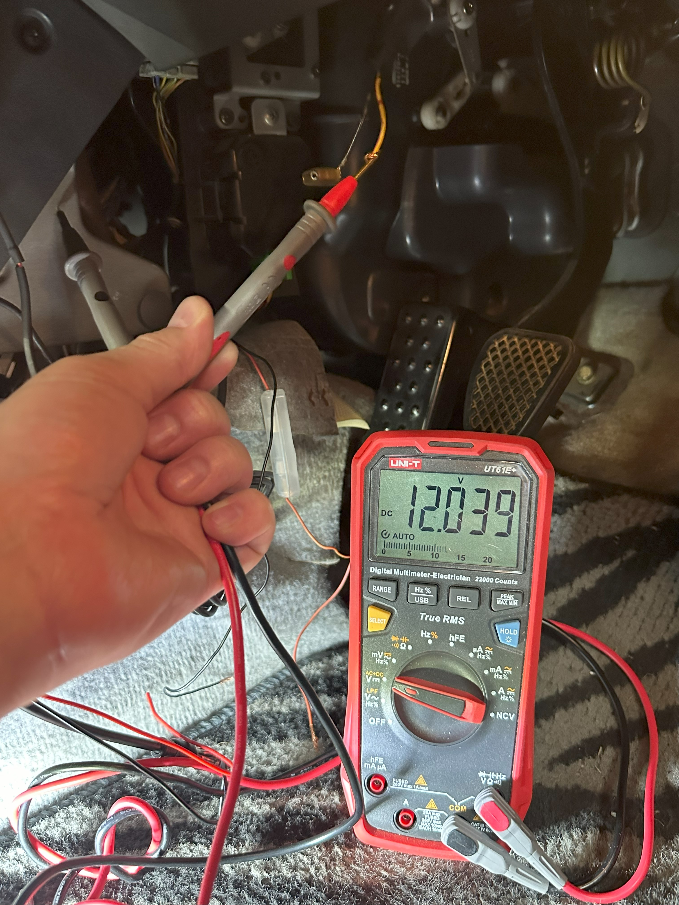
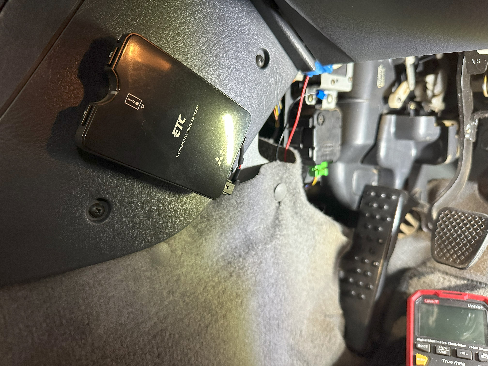

## Intro
If you're reading this tutorial, it's probably because you were disappointed when your freshly-imported Beat could only tune in to 1 or 2 radio stations. If you're wondering why, it's because your Japanese radio works in the [76-95 MHz band](https://en.wikipedia.org/wiki/FM_broadcasting_in_Japan) and your region probably uses the [87.5/88-108 MHz band](https://en.wikipedia.org/wiki/FM_broadcast_band) for FM radio.

Thankfully, if you have the stock Honda Beat Gathers head unit, there's a relatively simple fix: Install a [band expander](https://en.wikipedia.org/wiki/Band_expander) to tune in to stations above 95 MHz.

### What is a band expander?
The name "band expander" is a bit misleading. The device doesn't allow your radio to tune in to a wider range of stations. Rather, it shifts the frequency of each station by a set amount. Your head unit will still show 76-95 but you'll actually be listening to something 14 Mhz (or 28 MHz) higher.

Units like the one pictured above claim to reduce the 90-104 MHz bands by 14 MHz (to 76-90 MHz) and the 104-108 MHz bands by 28 MHz (to 76-80 MHz). Anything under 90 MHz is left alone.

To make this more concrete, here's how a few LA radio stations would be reduced:

| Station | True Freq | In-car Freq | Format |
|:-------:|:-------:|:-------:|:-------:|
|  KKJZ   |  88.1   |  88.1     | Jazz |
|  KXLU   |  88.9   |  88.9     | College |
|  KCRW   |  89.9   |  89.9     | Public radio |
|  KUSC   |  91.5   |  77.5   | College |
|  KRRL   |  92.3   |  78.3   | Hip-hop |
|  KDAY   |  93.5   |  79.5   | Classic hip-hop |
|  KTWV   |  94.7   |  80.7   | Urban contemporary |
|  KLOS   |  95.5   |  81.5   | Classic rock |
|  KYSR   |  98.7   |  84.6   | Alternative |
|  KIIS   |  102.7  |  88.7   | Top 40 |
|  KBIG   |  104.3  |  76.3   | 90s to now |
|  KPWR   |  105.9  |  77.9   | Hip-hop |
|  KROQ   |  106.7  |  78.7   | Alternative |

### Drawbacks
The main drawback of using a band expander is that we're trying to get a radio that can receive 14 MHz of spectrum to receive 20 MHz of spectrum. In this way, I guess it _technically_ expands the available FM bands. However, in practice, it's more likely to create frequency collisions that could reduce the number of stations you can hear clearly.

For example, based on [Radio Locator](https://radio-locator.com/cgi-bin/locate?select=city&city=Los%20Angeles&state=CA) data, these are all of the potential collisions in Los Angeles:

| Freq | Station 1 | Station 2 | Conflicting Formats |
|:-------:|:-------:|:-------:|:-------:|
| 76.3 | 90.3 | 104.3 | Spanish/Adult contemporary |
| 76.7 | 90.7 | 104.7 | Public radio/Rhythmic oldies |
| 77.1 | 91.1 | 105.1 | Classical/Country |
| 77.5 | 91.5 | 105.5 | Classical/Regional Mexican |
| 77.9 | 91.9 | 105.9 | Christian/Hip-hop |
| 78.3 | 92.3 | 106.3 | Hip-hop/Asian |
| 79.1 | 93.1 | 107.1 | Adult hits/Spanish hits |
| 79.5 | 93.5 | 107.5 | Classic hip-hop/Spanish hits |
| 88.7 | 88.7 | 102.7 | College/Top 40 |
| 89.9 | 89.9 | 103.9 | Public radio/Spanish hits |

There are some very popular stations in there — KCRW, KDAY, KIIS, KBIG, KPWR — and, in my testing, the more popular station came in clear enough that you wouldn't know there's a conflict at all. Only one frequency (79.5) had noticeable interference. This is potentially great news if you like pop, hip-hop, country, and other popular genres of music. It's less good if you like regional stations, classical, or Christian.

To determine the potential frequency collisions in your area:
1. Look up the available stations in your Zip code on [Radio Locator](https://radio-locator.com/).
2. Add 14 to each station under 90 MHz to see if there's a conflict (e.g., if your area gets 88.7 and 102.7, you have a conflict because 88.7 + 14 = 102.7).
3. Subtract 14 from each station over 104 MHz to see if there's a conflict (e.g., if your area gets 106.3 and 92.3, you have a conflict because 106.3 - 14 = 92.3).

{: .tools }
> 1. **FM band expander** (I bought [this cheap one](https://www.amazon.com/dp/B07TV7MWT1) on Amazon)
> 2. **Multimeter** (anything capable of measuring 12v DC will do)
> 3. **22-18 AWG ring terminal**
> 4. **22-18 AWG quick disconnect**
> 5. **Crimp tool**
> 6. **22-18 AWG insulated wire**

## Instructions

### Step 1: Peel back carpet to gain access to antenna connection

The back of your Gathers head unit looks like this:

The bit circled in red is the port where your radio antenna plugs in, and it's where we'll insert our band expander.

Fortunately, you should be able to reach this port without removing the head unit. Simply peel back the carpet in the driver's footwell until you can see the antenna cable poking out:

You should only need to undo a bit of velcro and get around a single snap. It really doesn't take much. You'll also have fewer wires and obstacles in the way than the photo suggests. I have a Japanese electronic toll card installed in this same spot.

While this tutorial doesn't require removal of the head unit, it's worth noting that the small gold screw in front of the antenna cable is one of the only two holding the head unit in place. To remove the head unit, simply undo that gold screw and its twin on the other side. Please remember that these are JIS screws and a normal Phillips head could strip it!

### Step 2: Unplug the antenna

Unplugging the antenna should be pretty straightforward. It won't require much force but, if you've got beefy fingers, you may want to use a small pair of pliers to grip the metal collar and pull. Just be sure not to damage the plug, as we'll need to use it again.

### Step 3: Attach the ring terminal and quick disconnect to the band expander

I did this later in the process but, looking back, I wish I had done it while the band expander was still outside the car.

Strip about 3/4 of an inch from the end of the ground (black) and power (red) wires on the band expander:

Next, crimp the ring terminal to the ground (black) wire and one half of the quick disconnect to the power (red) wire. We'll connect the ring terminal to a screw and the quick disconnect to a 12v accessory wire in a later step.

### Step 4: Connect the band expander to the head unit

This step is pretty straightforward. Plug the antenna cable into one end of the band expander and then plug the other end into the head unit where you previously removed the antenna cable. It should look like this:

The band expander should glide smoothly into the head unit. If you're meeting any resistance, back it out and try again. You probably came in at a slight angle. You'll eventually get it. Be patient. You're having a good time.

### Step 5: Ground the band expander

You have some flexibility here. The goal is to connect the ring terminal you attached in Step 3 to a bare metal post. I ended up using this screw:

Just remember that all of the screws under here are JIS and not Phillips. If you use a Phillips screw driver, be careful not to strip them.

### Step 6: Power the band expander

We're nearly done! The goal here is to find a wire we can tap in to for 12v power. The band expander pulls around half an amp, so you can be pretty confident that you won't blow a fuse no matter what source you choose. The key is finding a source that is only powered when the key switches to the accessory position. Otherwise, the band expander will _very_ slowly drain your battery.

There are several options for 12v accessory power behind the head unit, but my hands are a bit too beefy to reach them comfortably. If that's true for you too, you can put that 22-18 AWG wire to use! The fuse box under the dash on the right has plenty of options. I ended up tapping into one of those wires and running a piece of wire under the dash and over to the band expander:

Not sure how to find a 12v accessory power source? Turn your key to ACC or ON, connect the black probe on your multimeter to any of the bare metal surfaces under the dash, and then poke around with the red probe until you find a source providing 12v:

{: .aside-title }
> Why not tap into your ETC card reader?
> 
> Many of the Japanese cars that are eligible for import into the U.S. will come with an aftermarket electronic toll collection (ETC) card reader. It's typically a small black box that, if connected to power, likely talks to you when you turn on the ignition. This is a great spot to tap for ignition power! Even if you don't have an ETC box, your car may have been wired for one. So, hunt around for loose wires in the driver or passenger footwells.

When you find a 12v source, switch the key to the off position and test the source again. If it reads 0v, you found your power source. If you're still reading 12v, start the search again.

### Step 7: Test the band expander

Your band expander should be fully functional now! Before we tuck everything away, you should test it by turning on the radio and scrolling through stations. If you're in the U.S. and receiving any stations below 88 MHz, you succeeded! In my case, I was blasting T. Swift before I even left the 70s.

### Step 8: Hide the band expander

With everything wired and tested, you can now tuck the band expander behind your head unit and re-install the carpet. This is one of the rare times as a Beat owner that you'll find yourself with more than enough space.

Now, save some presets and enjoy!
