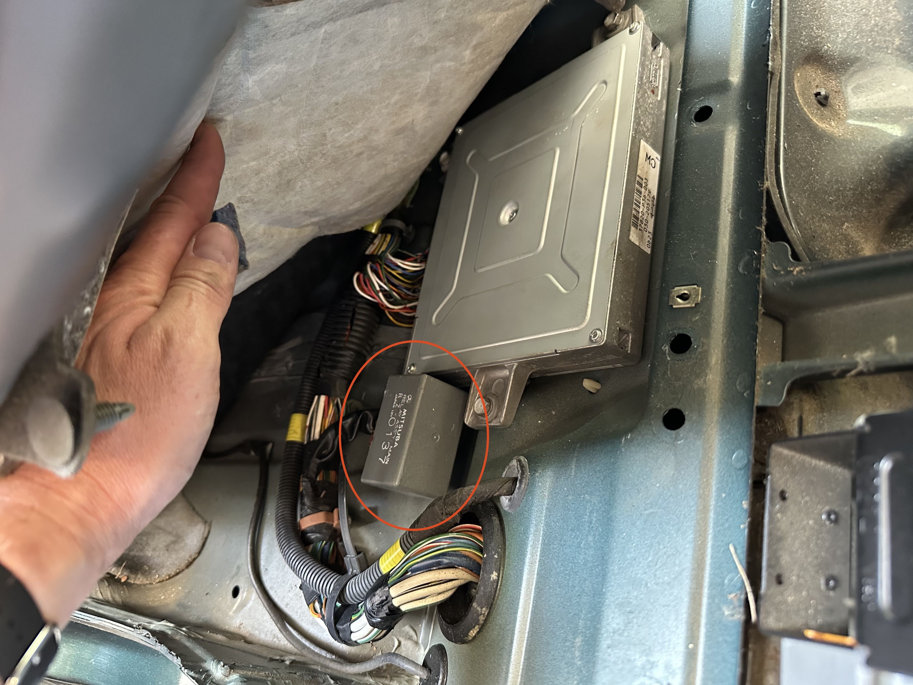
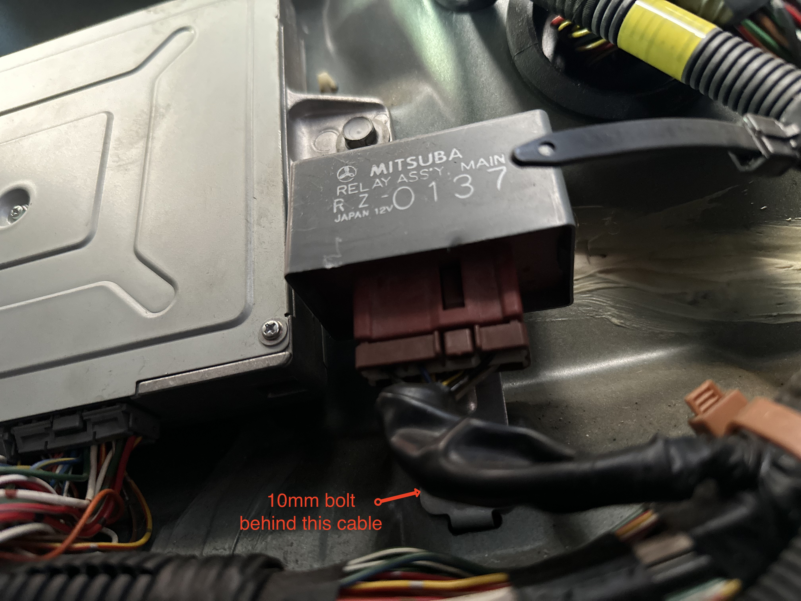
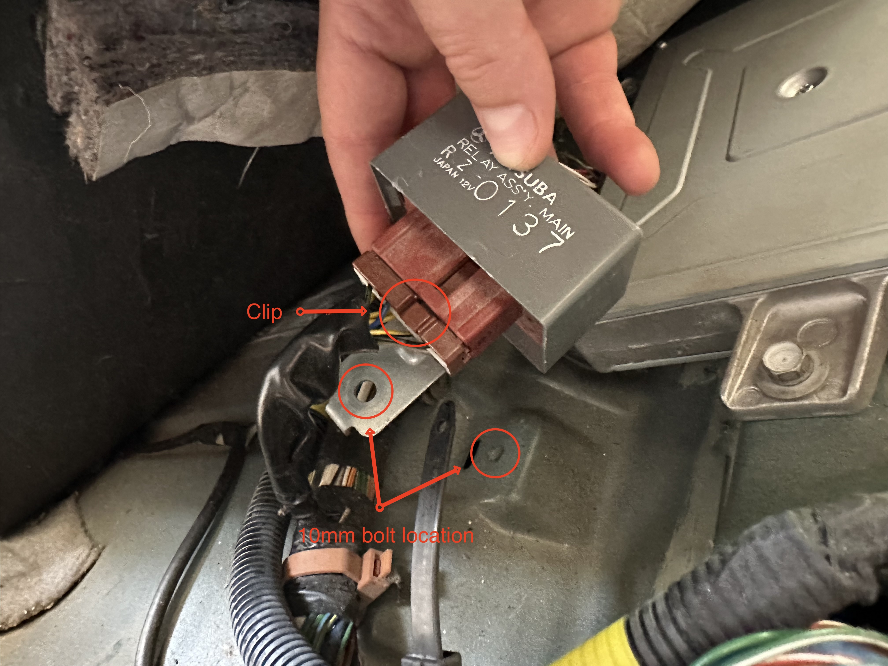
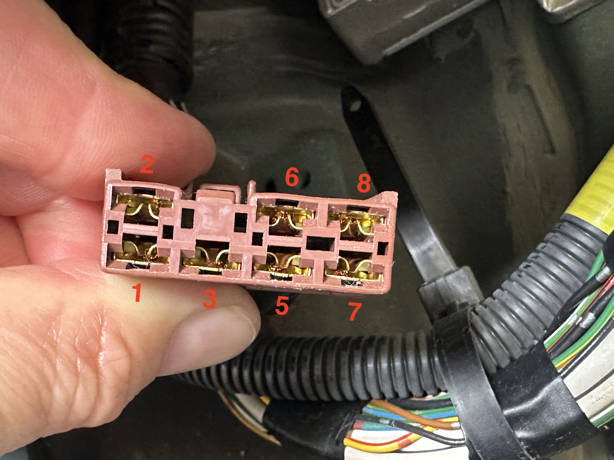
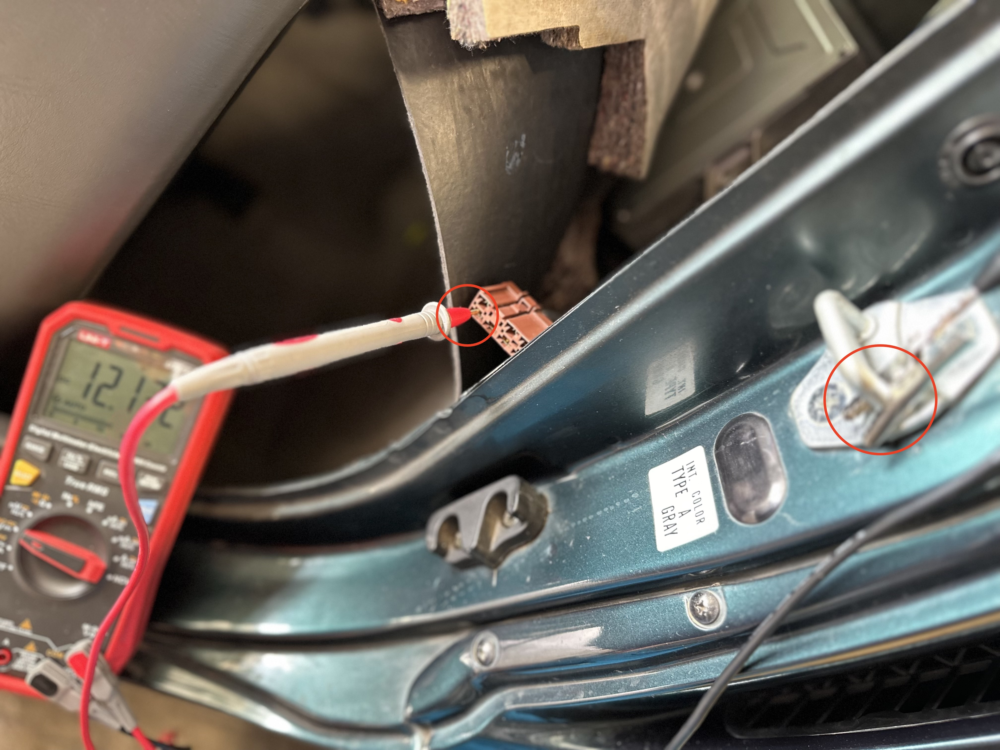
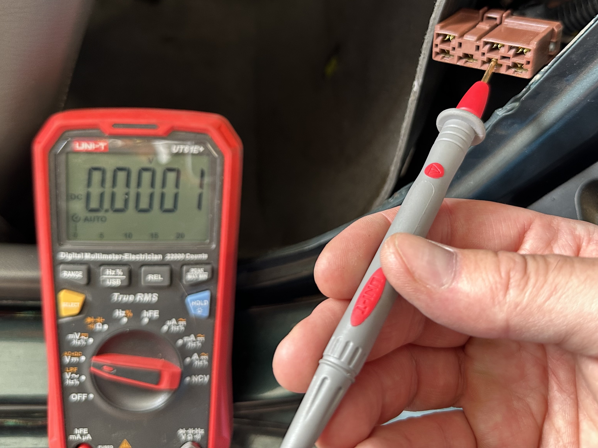
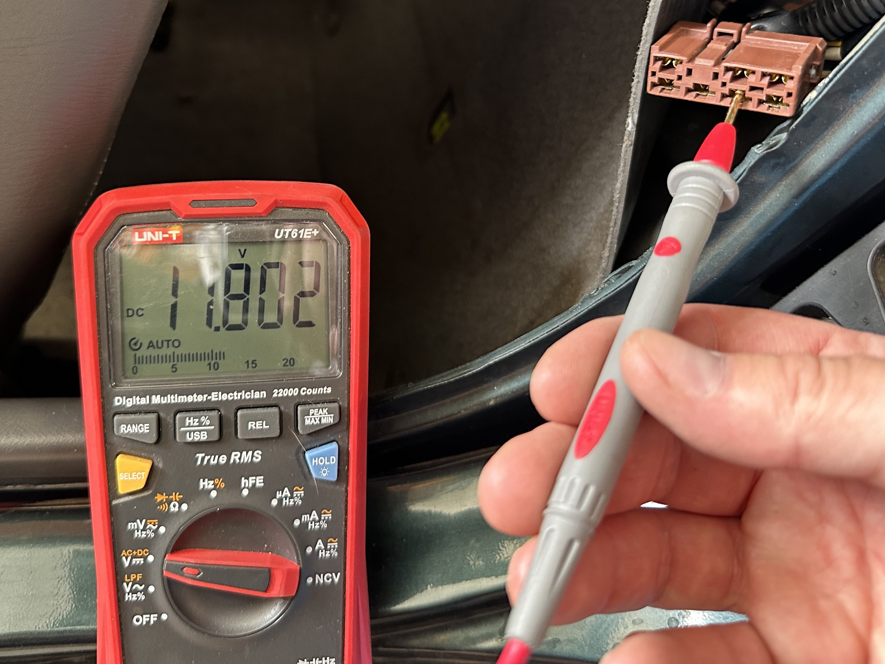

## Intro
This guide will walk you through the process of installing a kill switch that disables your fuel pump. There are quite a few ways to set up a kill switches, but I like the fuel pump cut-off because, as long as the would-be criminal doesn't find the switch, there's no way to steal the car short of towing it. Cutting fuel (instead of the battery) means the car will also power on and crank, so it's not immediately obvious that a security measure is at play. The thief may assume your 90s Honda is just a piece of junk and move on.

{: .tools }
>  1. **25A switch**
>  2. **Multimeter**
>  3. **10mm socket/wrench**
>  4. **16 AWG wire**
>  5. **Butt connectors**
>  6. **Crimping tool**
>  7. **Heat shrink tubing**
>  8. **Heat gun** (or hair dryer)
>  9. **JIS 2 screwdriver**

## Instructions

### Step 0: Access your main relay

To rig our kill switch, we'll need access to the Beat's main relay. Luckily, I've already written [a guide for accessing the relay](../access-beat-ecu-and-main-relay). Once you've worked through that tutorial, I'll see you back here at Step 1.

### Step 1: Unplug the main relay (technically optional)

{: .warning }
> We're removing the main relay so we can we can determine which wire to cut to install our kill switch. I had to do this because there weren't any resources available on the internet. In theory, all Beats should be wired in the same way and you can skip testing and jump straight to Step 3. However, there's always a chance my Beat isn't exactly the same as your Beat. Please test so you don't break your car.

After gaining access to your main relay, we need to unplug it so we can access the pins on the harness.

The main relay is secured by a single 10mm fastener:

Once the fastener is removed, push in this clip and carefully wiggle the plug while pulling straight back:

If you're having trouble removing the plug, you can try to gently separate the parts with plastic pry tools.

### Step 2: Find the fuel pump wire

With the main relay unplugged, we now need to find the wire that runs to the fuel pump.

{: .aside-title }
> What is a main relay?
> 
> The main relay is a single unit that contains two separate relays. When the ignition key is turned, one relay supplies power to the fuel injectors, ECU, and second relay. The second relay supplies power to the fuel pump.

To figure out which wire is providing power to the fuel pump, we'll use our multimeter to test each pin to find the one that supplies +12v when the key is turned to ACC.

To start, connect the black probe of your multimeter to a ground. Any bare metal surface will do. I connected mine to the door latch, which can be seen below.

Next, **with the car off**, insert the red probe into each of connector pins to see if any supply a constant +12v. If they do, we know these aren't the wires we're looking for and can safely ignore them in the next step. In my case, Pin 1 was always hot and could be safely ignored.

Now, **with the car turned on or in the ACC position**, once again probe each of the terminals to see which are supplying +12v. You should find one terminal that is now supplying power that wasn't when the car was off. In my case, it was Pin 5.

### Step 3: 

**_[Coming soon.]_**