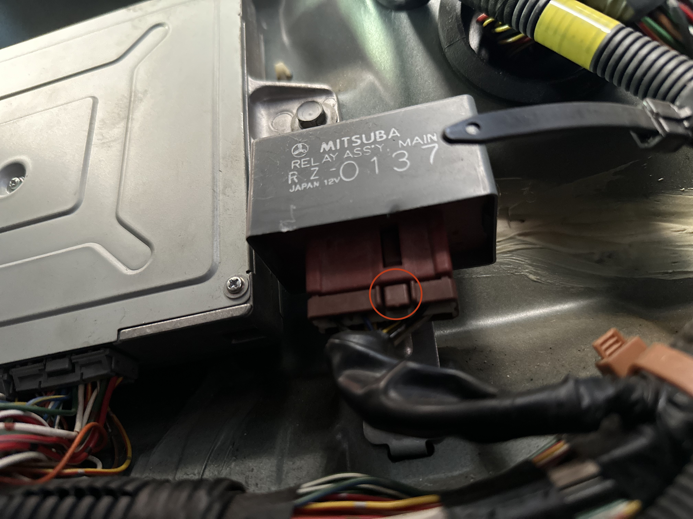

## Intro
This guide will walk you through the process of installing a kill switch that disables your fuel pump. There are quite a few ways to set up a kill switches, but I like the fuel pump cut-off because, as long as the  criminal doesn't find the switch, there's no way to steal the car short of towing it. Cutting fuel (instead of the battery) means the car will also power on and crank, so it's not immediately obvious that a security measure is at play. The thief may assume your 90s Honda is just a piece of junk and move on.

{: .tools }
>  1. **25A switch**
>  2. **Multimeter**
>  3. **10mm socket/wrench**
>  4. **16 AWG wire**
>  5. **Butt connectors**
>  6. **Crimping tool**
>  7. **Heat shrink tubing**
>  8. **Heat gun** (or hair dryer)
>  9. **JIS 2 screwdriver**

## Instructions

### Step 0: Access your main relay

To rig our kill switch, we'll need access to the Beat's main relay. Luckily, I've already written [a guide for accessing the relay](../access-beat-ecu-and-main-relay). Once you've worked through that tutorial, I'll see you back here at Step 1.

### Step 1: Unplug the main relay (optional)

{: .warning }
> We're removing the main relay so we can we can determine which wire to cut to install our kill switch. I had to do this because there weren't any resources available on the internet. In theory, all Beats should be wired in the same way and you can jump straight to Step 3 and copy what I did without doing any testing. However, there's always a chance my 1994 Beat isn't the same as your 1991 Beat and your car won't run if you follow this guide without testing. Please test.

After gaining access to your main relay, we need to unplug it so we can access the pins on the harness.

The main relay is secured by a single 10mm fastener:

Once the fastener is removed, push in this clip and carefully wiggle the fastener while pulling straight backL

If you're having trouble removing the plug, you can try to gently separate the parts with plastic pry tools.

### Step 2: Find

### Step 3: 